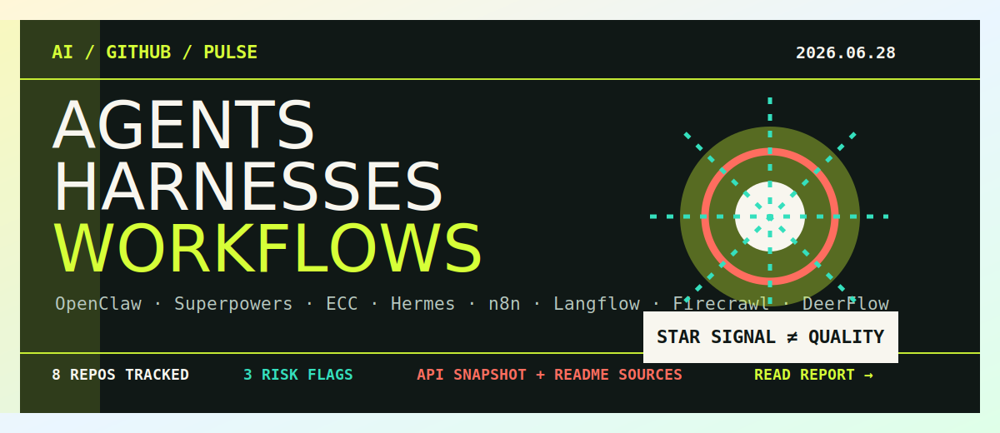

# AI GitHub 趋势报告

面向 AI 开源项目的可核查趋势快报：结合 GitHub 仓库页、README、release、近期推送、公开研究与上期快照，筛选过去几天关注度上升明显的 AI 项目、文章型仓库和工程信号。

- 最新动态网页：[index.html](index.html)
- 最新报告：[2026-06-28](reports/ai-github-trends/2026-06-28.md)
- 历史报告：[2026-06-21](reports/ai-github-trends/2026-06-21.md) · [2026-06-05](reports/ai-github-trends/2026-06-05.md)
- GitHub Pages（启用后）：https://anejuxula20-ctrl.github.io/ai-skills-summarise/

## 本期结论

- 注意力从单一聊天入口继续转向个人常驻代理、agent harness/skills 方法论、生产工作流平台和网页数据层。
- OpenClaw、Superpowers、ECC、Hermes Agent 等新近高 star 仓库值得跟踪，但异常高 star 本身也是风险信号。
- n8n、Langflow、Firecrawl、DeerFlow 更接近可落地的连接器、工作流、网页上下文和长任务 agent 基础设施。
- star 不是采用证明；引入前仍需检查许可证、维护节奏、issue/PR 质量、发布包、安全默认值和可观测性。
