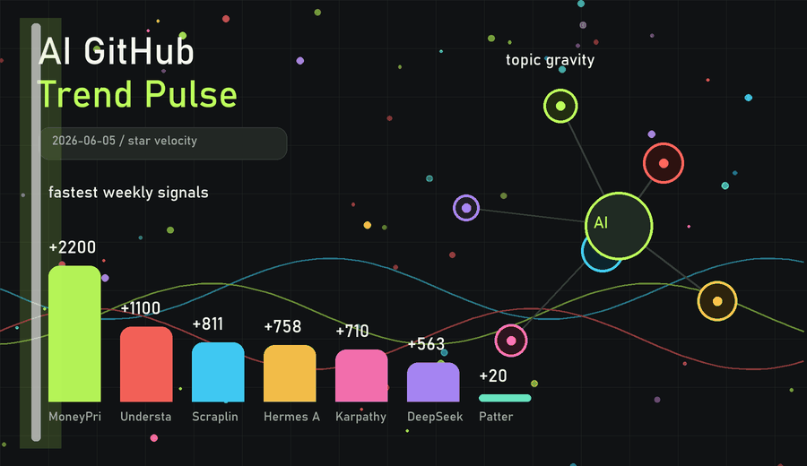

# AI GitHub 趋势报告

这是一份面向 AI GitHub 热点项目的自动化趋势报告，优先关注近期 star 增长、榜单 breakout、AI agent、coding assistant、AI skills、内容生成与技能安全方向。

- 动态网页：[index.html](index.html)
- 最新报告：[reports/ai-github-trends/2026-06-05.md](reports/ai-github-trends/2026-06-05.md)
- GitHub Pages 地址（启用 Pages 后）：https://anejuxula20-ctrl.github.io/ai-skills-summarise/

## 本期看点

- MoneyPrinterTurbo、Understand-Anything、Hermes Agent 继续占据高关注度位置。
- AI skills 从开发辅助扩展到内容设计、社媒图文和安全审计。
- star velocity 适合作为早期信号，但仍需要结合 issue、release、fork、真实使用场景交叉验证。
